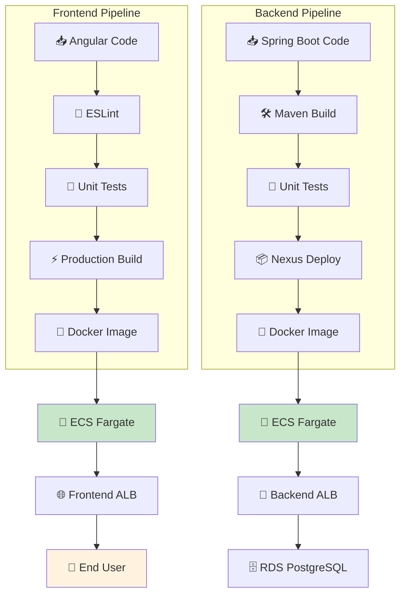
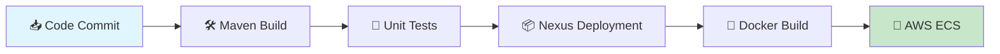
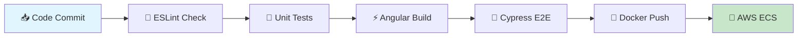

# 📝 ToDo List App - Full Stack AWS Deployment

## 🚀 Live Application
**Access the deployed application here:**  
🔗 **[http://todo-app-alb-911217416.us-east-1.elb.amazonaws.com](http://todo-app-alb-911217416.us-east-1.elb.amazonaws.com)**

---

## 🧪 Quick Testing
**Demo Account for immediate access:**
- **Username**: `mariem`
- **Password**: `Password20`

**Alternative Login Methods:**
- 🔐 **Google OAuth** - Sign in with your Google account
- 📝 **New Registration** - Create your own account

---

## 📖 Overview
A modern, collaborative Todo List application featuring real-time updates, built with **Angular** and **Spring Boot**, deployed on **AWS cloud infrastructure**.

## 🎯 Features

### ✨ Core Functionality
- ✅ **Task Management** - Create, edit, and organize tasks
- 👥 **Team Collaboration** - Shared boards and real-time updates  
- 📅 **Calendar Integration** - Visual task planning
- 🔔 **Live Notifications** - Instant updates across devices
- 🌐 **Social Login** - Google OAuth integration

### 🛡️ Security & Authentication
- 🔐 JWT-based authentication
- 👤 Multiple login options (Email/Password + Google OAuth)
- 🎪 Secure session management
- 📧 Password reset functionality

## 🏗️ Full Deployment Architecture

## 🏗️ Technical Architecture

### Frontend (User Interface)
| Component | Technology | Deployment |
|-----------|------------|------------|
| **Framework** | Angular 20+ | ECS Fargate |
| **UI Library** | Angular Material | Application Load Balancer |
| **State Management** | RxJS + Signals | Port 80 |
| **Real-time** | WebSocket Client | |

### Backend (Business Logic)
| Component | Technology | Deployment |
|-----------|------------|------------|
| **Framework** | Spring Boot 3.x | ECS Fargate |
| **Database** | PostgreSQL | RDS Instance |
| **Authentication** | JWT + OAuth2 | Application Load Balancer |
| **Real-time** | WebSocket/STOMP | Port 8080 |

### Infrastructure
| Service | Purpose | Configuration |
|---------|---------|---------------|
| **AWS ECS Fargate** | Container Orchestration | Auto-scaling enabled |
| **Application Load Balancer** | Traffic Distribution | Health checks configured |
| **RDS PostgreSQL** | Data Storage | Automated backups |
| **Security Groups** | Network Security | Layer-specific rules |

## 🚀 Getting Started

### 🌐 Access Production
  **1. Open**: [Live Application](http://todo-app-alb-911217416.us-east-1.elb.amazonaws.com)

   **2. Login** using:
   - Demo: `mariem` / `Password20`
   - Google account
   - New registration

### 💻 Local Development

#### Backend Setup
```bash
cd todo-backend
docker-compose up --build -d
# API: http://localhost:8080
# Docs: http://localhost:8080/swagger-ui/index.html
```

#### Frontend Setup
```bash
cd todo-frontend
npm install && ng serve
# App: http://localhost:4200
```

## ⚙️ System Features

### Backend Capabilities
- **User Management** - Registration, profile updates, authentication
- **Board System** - Create, share, and manage collaborative boards
- **Real-time Messaging** - WebSocket for live updates
- **RESTful API** - Comprehensive endpoints for all operations
- **Email Services** - Password reset and notifications
- **Data Validation** - Robust input sanitization

### Frontend Capabilities
- **Responsive Design** - Works on desktop and mobile
- **Component Architecture** - Modular, maintainable codebase
- **State Management** - Efficient data flow with RxJS
- **Type Safety** - Full TypeScript implementation
- **Testing Suite** - Unit, integration, and E2E tests

## 🔄 CI/CD Pipeline

### Backend Automation


### Frontend Automation


## 🛠️ Operational Excellence

### ✅ Current Status
- 🟢 **Frontend**: Fully operational and accessible
- 🟢 **Backend**: All endpoints responding correctly
- 🟢 **Database**: Secure connections established
- 🟢 **Real-time**: WebSocket communications active
- 🟢 **Authentication**: Multiple login methods working

### 📊 Monitoring
- **Health Checks**: Application Load Balancer monitoring
- **Logging**: Centralized logs via CloudWatch
- **Metrics**: Performance and error tracking
- **Auto-scaling**: Dynamic resource allocation

### 🔒 Security
- **Network Isolation**: VPC with public/private subnets
- **Access Control**: Security groups with minimal open ports
- **Data Protection**: Encrypted database connections
- **Authentication**: JWT tokens with expiration

## 🎯 Deployment Highlights

### 🚀 Successfully Implemented
- ✅ **Full-stack deployment** on AWS cloud
- ✅ **Containerized applications** with Docker
- ✅ **Load-balanced traffic** for high availability
- ✅ **Database persistence** with RDS PostgreSQL
- ✅ **Automated CI/CD** with Jenkins
- ✅ **Real-time capabilities** with WebSocket
- ✅ **Production monitoring** and health checks

### 🔮 Planned Enhancements
- **HTTPS Encryption** - SSL certificate implementation
- **Advanced Caching** - Redis for performance
- **Enhanced Monitoring** - Detailed CloudWatch dashboards
- **Blue-Green Deployment** - Zero-downtime updates
- **Database Optimization** - Read replicas and indexing
- **Security Hardening** - AWS WAF integration


---

### 👩‍💻 Developed with ❤️ by Mariem BELDI.
  

### 🛠️ Technology Stack
**Frontend**: Angular • TypeScript • RxJS • Signals 
**Backend**: Spring Boot • Java 21 • JWT • WebSocket • PostgreSQL  
**DevOps**: AWS ECS • Docker • Jenkins • Nexus • RDS  
**Testing**: JUnit • MockMvc • Cypress • ESLint

---

